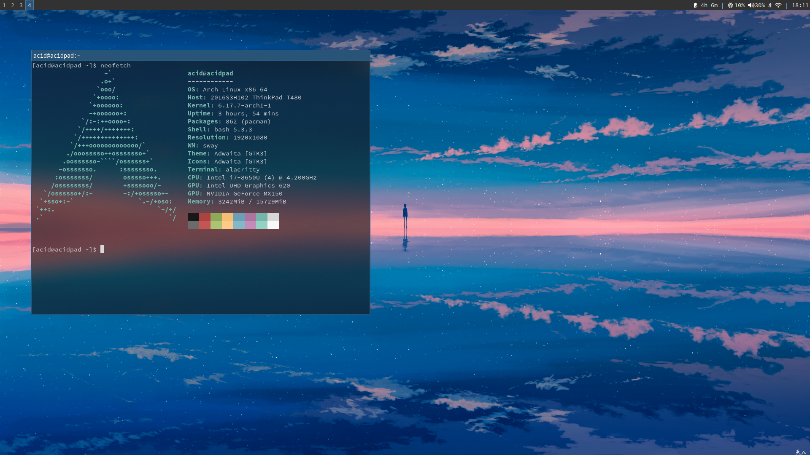

# Sway/Swayfx Minimal Status Bar

This directory contains a very small set of scripts to drive a simple, fast status bar for Sway or Swayfx. The bar shows the battery, any additional status snippets from `status.d/`, and the current time.

- Battery (left): concise battery summary derived from UPower
- Center: outputs from any executable scripts in `~/.config/sway/status.d`
- Time (right): current time in HH:MM

The core loop is implemented in `statusbar.sh`. Supporting scripts live alongside it and under `status.d/`.

<p align="center">
  
</p>


## Files

- `statusbar.sh` — main loop that prints a single status line every second: `<Battery> | <Status Icons> | <Time>`
- `battery.sh` — reads UPower's DisplayDevice and prints a semicolon-delimited line: `icon;label;color;default`
- `power.sh` — tiny helper that converts `battery.sh` output into a compact human-readable string (used similarly to `batt_short` in `statusbar.sh`)
- `status.d/` — drop-in directory for optional status items. Any executable file here is run and its single-line output is appended in the middle section

## Requirements

- Bash (for the scripts)
- UPower (for battery information). The scripts use the aggregated `DisplayDevice`
- Optional: `bluetoothctl` for the included `status.d/bluetooth.sh`

If UPower is unavailable or the machine has no battery (e.g. desktop), the battery section is omitted automatically.

## How it works

1. `statusbar.sh` loops once per second
2. It calls `battery.sh` (if present and executable) and compresses that into a short left section (e.g. `󱟞 4h 12m`, `󱟠 1h 05m`, or `🔌` when full)
3. It executes each executable file in `~/.config/sway/status.d` (in lexical order) and concatenates their outputs with spaces for the center section
4. It appends the current time as the right section
5. Only non-empty sections are printed; sections are separated by ` | `

## Using with Sway/Swayfx

Add a bar block to your sway config to execute the script. For vanilla swaybar:

```
bar {
    status_command exec ~/.config/sway/statusbar.sh
}
```

For Swayfx with its bar, the same `status_command` applies. Ensure the scripts DIR is executable:

```
chmod -R +x ~/.config/sway/status.d
```

## Adding items via status.d/

Place any executable script in `~/.config/sway/status.d`. The script should:

- Print a single line to stdout (no trailing newlines required; they are trimmed)
- Exit 0 on success; errors are ignored so a failing script won’t break the bar
- Be fast (ideally <10–20ms) to avoid jank; consider caching or async daemons for expensive queries

Example: `~/.config/sway/status.d/bluetooth.sh` (already included) prints `` when connected and `󰂯` otherwise.

Another example, show volume (pactl):

```
#!/usr/bin/env bash
set -euo pipefail
sinks=$(pactl get-sink-mute @DEFAULT_SINK@ 2>/dev/null || true)
vol=$(pactl get-sink-volume @DEFAULT_SINK@ 2>/dev/null | awk 'NR==1{print $5}')
if echo "$sinks" | grep -q 'Mute: yes'; then
  echo "󰝟 $vol"
else
  echo "󰕾 $vol"
fi
```

Save it as `~/.config/sway/status.d/20-volume.sh` and make it executable. It will appear in the center section automatically.

## Battery details

`battery.sh` uses UPower’s `DisplayDevice` to aggregate multiple batteries (e.g. ThinkPad dual battery). It emits:

```
icon;label;color;default
```

- icon: visual state (discharging `󱟞`, charging `󱟠`, full `🔌`, empty `󰂎`)
- label: human-friendly text like `1h 42m remaining`, `58m to full`, `Full`, or `92%` as a fallback
- color: basic color hint for bars that support it (red/yellow/green by percentage thresholds)

`statusbar.sh` parses this and converts it to a concise left section. When full, it shows only the plug icon.

## Troubleshooting

- Nothing shows for battery: ensure `upower` is installed and `upower -e` lists a `/org/freedesktop/UPower/devices/DisplayDevice`
- Missing icons: install a font that supports Nerd Fonts/Unicode glyphs (e.g. JetBrainsMono Nerd Font)
- Slow updates: ensure scripts in `status.d` are quick; avoid running heavy commands each second
- Bluetooth icon missing: install `bluez` and ensure `bluetoothctl` is available

## License

These scripts are provided as-is; adapt them freely to your setup.

