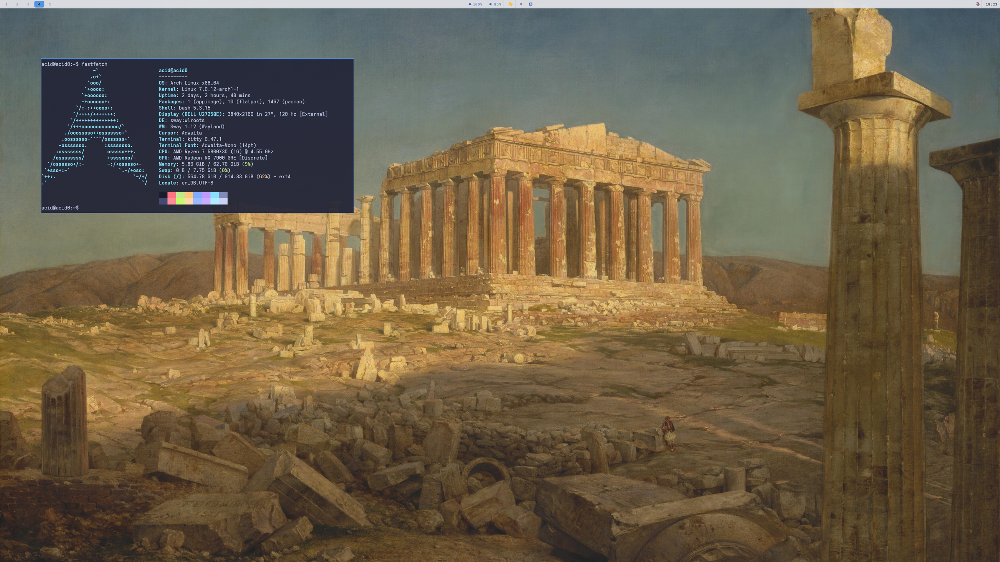

# sync: a Sway/SwayFX desktop

[](https://github.com/aajll/sync/actions/workflows/ci.yml)

A complete desktop for **Arch Linux (rolling)** and **Debian 13 (Trixie)**, built on Sway or SwayFX: from a bare machine to a working session in one flow.

- **Zero-to-online bootstrap**: unattended Arch base install (or the Debian installer), per-distro package manifests, and a staged idempotent provisioner. [`bootstrap/`](bootstrap/README.md)
- **The compositor config**: keybindings, workspace rules, and a per-machine overlay layer. [`config` + `config.d/`](docs/sway.md)
- **The status bar**: Waybar, native event-driven modules plus custom shell modules. [`waybar/`](docs/waybar.md)
- **One theme everywhere**: a single dark/light toggle across bar, terminal, launcher, and notifications, plus on-demand wallpaper rotation. [`scripts/` + `extra/`](docs/theming.md)
- **Hardware handling**: media keys, and a monitor-hotplug daemon with clamshell mode and per-monitor profiles. [`docs/hardware.md`](docs/hardware.md)

<p align="center">  </p>

## Layout

| Path | What it is |
|------|-----------|
| `config` | Primary Sway config. Includes `config.d/*`, the compose-key snippet rendered from `host.env` (copy `host.env.example`), and theme/SwayFX snippets generated under `$XDG_RUNTIME_DIR/sway/`. |
| `config.d/` | Drop-in Sway snippets: `waybar` (launches the bar), `wallpaper` (bootstraps `images/wp.png`; rotate on demand with `$mod+Shift+w`), `floating_windows`. |
| `waybar/` | Status bar: `config.jsonc` layout, `style.css`, `colors-{dark,light}.css` palettes, custom `modules/`. |
| `scripts/` | Utilities bound to keybinds / `exec` lines. See [`scripts/SCRIPTS.md`](scripts/SCRIPTS.md). |
| `extra/` | Standalone configs for adjacent tools (wofi, mako, swhkd). See [`extra/EXTRA.md`](extra/EXTRA.md). |
| `bootstrap/` | Zero → online: archinstall JSON, package manifests, provisioner. See [`bootstrap/README.md`](bootstrap/README.md). |
| `hooks/` | Tracked event-hook drop-ins run by `scripts/hooks.sh`; per-machine automation goes in the gitignored `hooks.local/`. |
| `tests/` | Sandboxed assertion suites for the session-external scripts (theme, OSD, quick-menu, power, idle, host-env, monitor). |
| `docs/` | Topic documentation (below). |
| `install.sh` / `uninstall.sh` | Set up / remove this desktop on an existing machine by delegating to the provisioner. See Setup. |

## Zero → online (new machine)

Fresh **Arch** (unattended, via `archinstall`) or fresh **Debian 13** (standard installer) → this desktop with no ISO build: per-distro package manifests plus a staged, idempotent provisioner (packages, services, ssh-agent, portals, age-encrypted secrets, tailscale) live in [`bootstrap/`](bootstrap/README.md). What "core" means and what is verified per distro: [docs/core-features.md](docs/core-features.md).

## Setup

The canonical install keeps the working tree outside the config directory and symlinks it in. `install.sh` does the preflight and delegates to the existing provision stages (packages, ssh-agent, portals, the sway symlink), then the XDG defaults, recording what it creates so `uninstall.sh` can remove exactly that.

```bash
git clone <this-repo> ~/sync
~/sync/install.sh                # preflight, then provision stages + defaults
```

Log into the Sway session; `config.d/waybar` and the theme/monitor hooks start automatically. See [docs/requirements.md](docs/requirements.md) for dependencies. Per-machine settings (compose key, wallpaper pool, idle timeouts, monitor overrides) go in `host.env`; copy `host.env.example`.

Alternative: clone directly into `~/.config/sway` (`git clone <this-repo> ~/.config/sway`) and run `scripts/setup-defaults.sh`. The provisioner's `sway` stage detects that layout and leaves it in place.

For a fresh machine (zero → online, including the base OS), use [`bootstrap/`](bootstrap/README.md) instead.

## Uninstall

```bash
~/sync/uninstall.sh              # removes what install.sh created, nothing else
~/sync/uninstall.sh --check      # dry run: report what would be removed
```

`uninstall.sh` is driven by the install manifest (`~/.local/state/sync/install-manifest`) and removes only recorded artifacts: the `~/.config/sway` symlink (never a real checkout), the ssh-agent environment export and `~/.profile` block, the rendered swhkd config, and the XDG default files. It never touches secrets, the wallpaper pool, `hooks.local/`, `host.env`, or the repository itself.

## Documentation

| Doc | Topic |
|-----|-------|
| [README.md](docs/README.md) | The docs index: one page per component, in reading order |
| [bootstrap.md](docs/bootstrap.md) | Zero to online: base install, package manifests, provisioner |
| [sway.md](docs/sway.md) | The core config: keybindings, drop-ins, per-machine overlays |
| [hooks.md](docs/hooks.md) | Event hooks: drop-in automation per event, with a machine-local overlay |
| [waybar.md](docs/waybar.md) | The status bar: layout, the module output contract, theming |
| [theming.md](docs/theming.md) | Dark/light toggle and wallpaper rotation |
| [hardware.md](docs/hardware.md) | Media keys, monitor hotplug, clamshell, floating windows |
| [requirements.md](docs/requirements.md) | The dependency contract (probe-and-degrade) |
| [core-features.md](docs/core-features.md) | The "just works" matrix, verified per distro |
| [xdg-defaults.md](docs/xdg-defaults.md) | Default terminal, MIME associations, desktop portals |
| [troubleshooting.md](docs/troubleshooting.md) | Symptom → check |

Contributor conventions live in [`CONTRIBUTING.md`](CONTRIBUTING.md); agent conventions live in [`AGENTS.md`](AGENTS.md).
